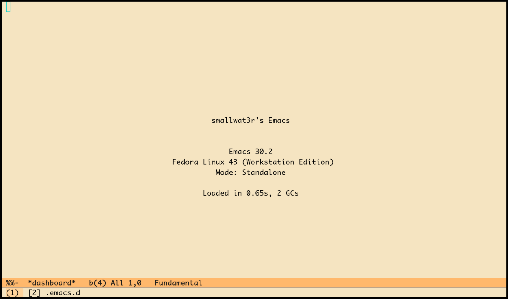

# smallwat3r's Emacs

Personal Emacs configuration in vanilla elisp. Requires Emacs 30+.



After years of using [Doom Emacs](https://github.com/doomemacs/doomemacs), many
keybindings and workflows here are influenced by it.

## Installation

Clone or symlink to `~/.emacs.d` and start Emacs. Packages install automatically
on first run.

## Package management

Packages are managed with [elpaca](https://github.com/progfolio/elpaca), which
provides async installation and version locking. The lockfile `elpaca-lockfile.el`
is version-controlled for reproducible installs.

Run `make` to see available commands:

```
$ make
  help       Show this help
  link       Symlink this directory to ~/.emacs.d
  install    Install packages (first run)
  update     Update all packages and save lockfile
  lock       Save current package versions to lockfile
  clean      Remove all installed packages
```

## Testing

Test startup time with:

```
./test-startup.el        # default 1s threshold
./test-startup.el 0.5    # custom threshold
```

Shows per-module breakdown and fails if total exceeds threshold.
