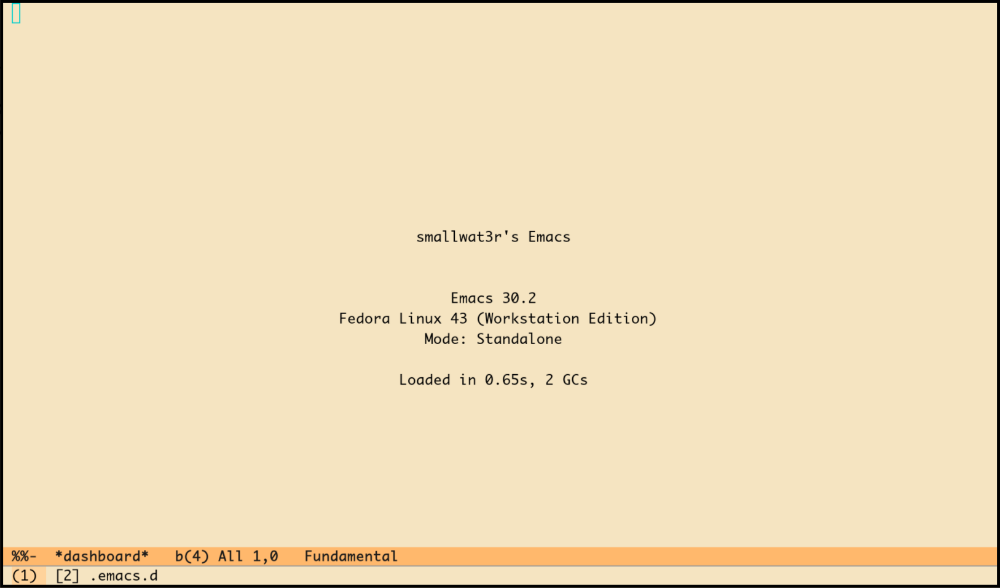

# smallwat3r's Emacs

Personal Emacs configuration in vanilla elisp. Requires Emacs 30+.



After years of using [Doom Emacs](https://github.com/doomemacs/doomemacs), many
keybindings and workflows here are influenced by it.

## Installation

Clone or symlink to `~/.emacs.d` and start Emacs. Packages install automatically
on first run.

## Package management

Packages are managed with [elpaca](https://github.com/progfolio/elpaca), which
provides async installation and version locking. Packages install automatically
when Emacs starts. The lockfile `elpaca-lock.el` is version-controlled for
reproducible installs.

Common commands (run in Emacs after startup):

- `M-x elpaca-update-all` - update all packages
- `M-x elpaca-write-lock-file` - save current versions to lockfile

## Claude Code sandbox

Claude Code runs inside a Docker container for sandboxing. The setup lives in
`docker/claude-sandbox/` (Dockerfile) and `bin/claude-docker` (wrapper script).

The wrapper script builds the image on first use, then runs Claude with the
project directory mounted read-write. Security hardening includes read-only
root filesystem, all capabilities dropped, no-new-privileges, and a PID limit.
A Docker socket proxy (tecnativa/docker-socket-proxy) gives the sandbox
limited access to the host's Docker daemon, so Claude can list, inspect,
and exec into other project containers (e.g. to run tests, check logs, or
debug a running dev service) without exposing full Docker control. The proxy
only allows container and exec operations, blocking image builds, network
changes, volume management, and other privileged actions.

To force rebuild the sandbox image (e.g. after a new Claude Code release):

```
M-x sw-claude-rebuild-sandbox
```

Run `make` to see available commands:

```
$ make
  help       Show this help
  link       Symlink this directory to ~/.emacs.d
  clean      Remove all installed packages
```
