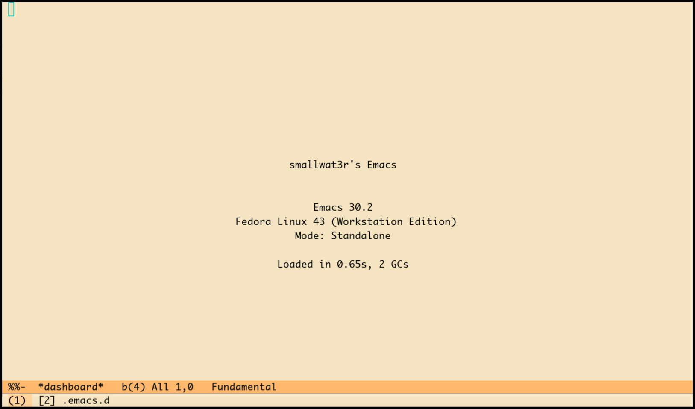

# smallwat3r's Emacs

Personal Emacs configuration in vanilla elisp. Requires Emacs 30+.



After years of using [Doom Emacs](https://github.com/doomemacs/doomemacs), many
keybindings and workflows here are influenced by it.

## Installation

Clone or symlink to `~/.emacs.d` and start Emacs. Packages install automatically
on first run.

## Package management

Packages are managed with [elpaca](https://github.com/progfolio/elpaca), which
provides async installation and version locking. Packages install automatically
when Emacs starts. The lockfile `elpaca-lock.el` is version-controlled for
reproducible installs.

Common commands (run in Emacs after startup):

- `M-x elpaca-update-all` - update all packages
- `M-x elpaca-write-lock-file` - save current versions to lockfile

Run `make` to see available commands:

```
$ make
  help       Show this help
  link       Symlink this directory to ~/.emacs.d
  clean      Remove all installed packages
```

## Claude Code sandbox

Claude Code runs inside a Docker container for sandboxing. The setup lives in
`docker/claude-sandbox/` (Dockerfile) and `bin/claude-docker` (wrapper script).

The wrapper script builds the image on first use, then runs Claude with the
project directory mounted read-write. Security hardening includes read-only
root filesystem, all capabilities dropped, no-new-privileges, and a PID limit.
A Docker socket proxy (tecnativa/docker-socket-proxy) gives the sandbox
read-only visibility into the host's Docker daemon, so Claude can list and
inspect other project containers and read their logs (e.g. to debug a running
dev service). Every write operation is blocked (run, exec, build, network and
volume changes): a write to the root daemon would let the sandbox spawn a
sibling container that mounts the host filesystem and escape entirely.

To upgrade the pinned versions in the Dockerfile, then rebuild the image:

```
M-x sw-claude-upgrade-sandbox
M-x sw-claude-rebuild-sandbox
```
